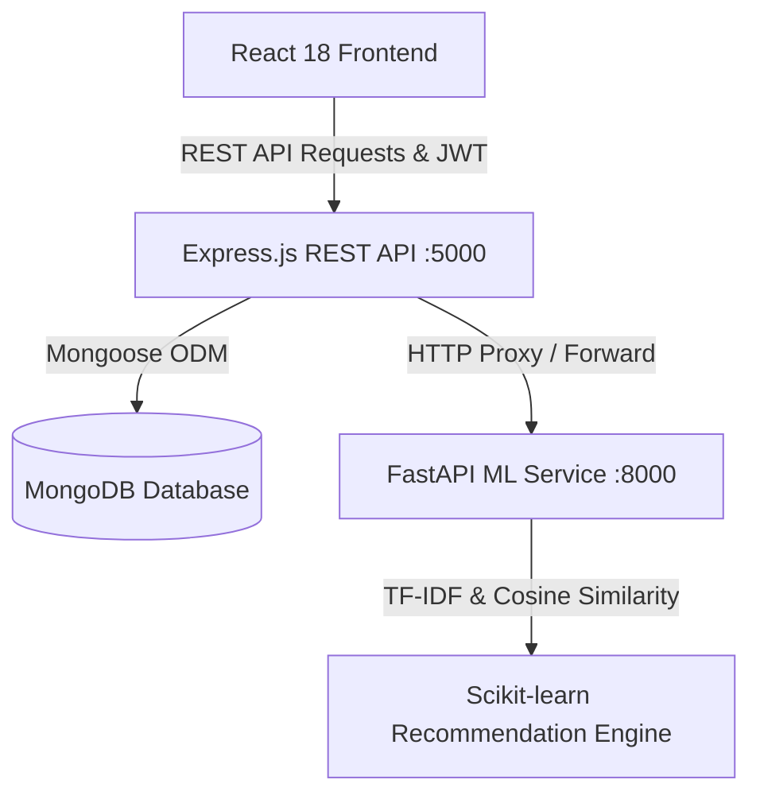

# Melomix 2.0 — System Architecture

## Overview
Melomix 2.0 is a distributed, multi-service music discovery and playback platform. It combines a modern single-page React frontend, a high-throughput Node.js/Express REST API, a dedicated Python/FastAPI Machine Learning service for content-based recommendations and natural language search, and a MongoDB persistence tier.

---

## 1. Frontend Architecture
* **Framework**: React 18 with TypeScript and Vite bundler.
* **Styling**: Tailwind CSS with Neutral Zinc Design System (`#F8F8FA` Light / `#09090B` Dark).
* **State Management**:
  * `AuthContext`: Manages active user sessions, token storage, and administrative roles.
  * `PlayerContext`: Persistent singleton HTML5 audio engine maintaining the playback queue, current song, volume, like states, autoplay, and error recovery.
  * `ThemeContext`: Toggles and persists daylight light mode vs deep dark mode.
  * `ToastContext`: Global animated notification feedback system.
* **Component System**:
  * Layout: `MainLayout` with responsive `Sidebar`, `Navbar`, persistent `BottomPlayer`, `NowPlayingDrawer`, and `PlaylistModal`.
  * Audio Widgets: `AudioVisualizer` (real-time canvas frequency spectrum), `LyricsWidget` (synchronized karaoke line scrolling), `SoundEqualizerWidget` (interactive 5-band hardware EQ).

---

## 2. Backend REST API Architecture
* **Runtime**: Node.js with TypeScript (`strict: true`).
* **Framework**: Express.js with Helmet security headers, CORS origin filtering, Morgan logging, and rate limiting.
* **Authentication**: JSON Web Tokens (JWT) signed with HMAC SHA-256 and bcryptjs password hashing (10 salt rounds).
* **Database Driver**: Mongoose ODM with automated failover:
  * In production, strictly requires external MongoDB connection string (`MONGODB_URI`).
  * In local development, seamlessly initializes an embedded MongoDB engine (`mongodb-memory-server`) if no external URI is specified, ensuring zero setup friction.
* **Auto-Seeder**: Detects unpopulated databases on startup and automatically inserts demo artists, albums, royalty-free audio tracks, demo users, and listening logs.

---

## 3. Machine Learning Service Architecture
* **Framework**: Python 3.10+ with FastAPI and Uvicorn ASGI server.
* **Data Processing**: Pandas and NumPy for tabular feature manipulation.
* **Feature Extraction & Similarity**:
  * Combines weighted metadata tokens (`genre`, `mood`, `artist`, `language`, `albumTitle`).
  * Transforms metadata into high-dimensional TF-IDF vectors (`sklearn.feature_extraction.text.TfidfVectorizer`).
  * Calculates pairwise cosine similarity (`sklearn.metrics.pairwise.cosine_similarity`) between the aggregated user taste profile and candidate songs.
* **Extensibility**:
  * Abstract `BaseRecommender` interface enables future expansion into Collaborative Filtering or deep Matrix Factorization without altering consumer API endpoints.
* **Natural Language Intent Extraction**:
  * Regex-based NLP intent parser extracting acoustic moods, genres, languages, and target activities from natural speech (e.g., "calm songs for working at night").
